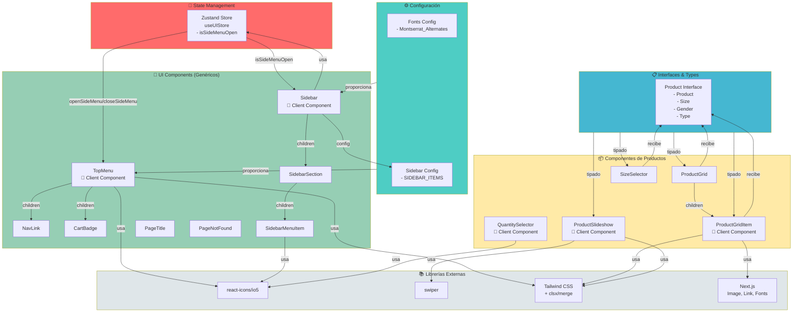
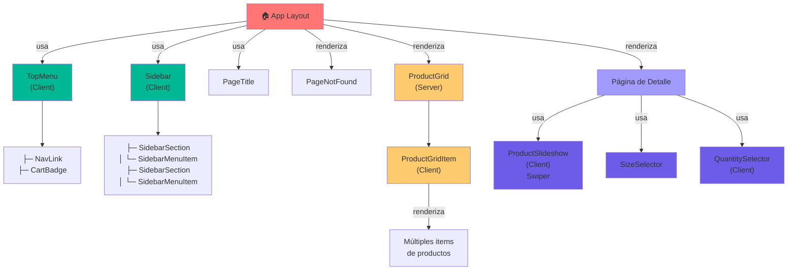
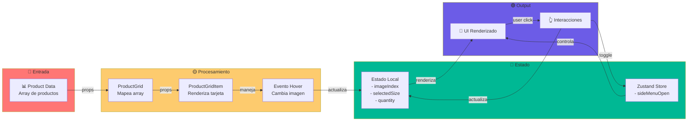
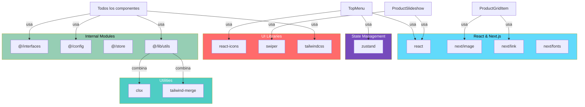
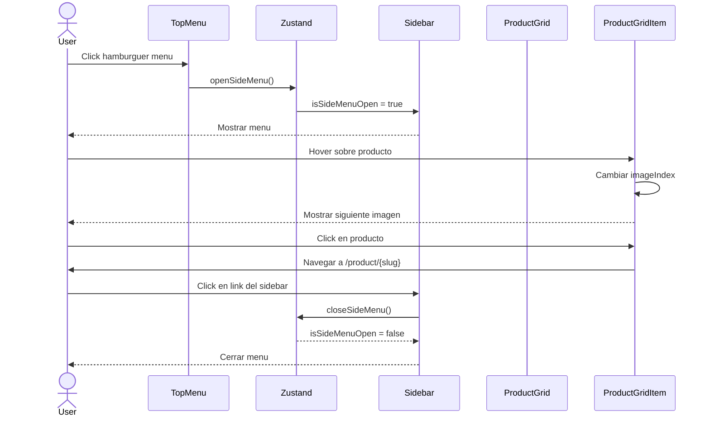

# Diagrama de Componentes - Teslo Shop

## 1. Diagrama General de Arquitectura



---

## 2. Diagrama Jerárquico (Composición)



---

## 3. Diagrama de Flujo de Datos (Data Flow)



---

## 4. Diagrama de Dependencias (Dependencies)



---

## 5. Matriz de Responsabilidades

| Componente | Responsabilidad | Tipo | Dependencias |
|-----------|------------------|------|--------------|
| **TopMenu** | Navegación principal, carrito | Client | Zustand, ReactIcons |
| **NavLink** | Enlace individual | Presentational | - |
| **CartBadge** | Badge de contador | Presentational | - |
| **Sidebar** | Menú lateral | Client | Zustand, Config |
| **SidebarSection** | Agrupador de items | Presentational | - |
| **SidebarMenuItem** | Item del sidebar | Presentational | ReactIcons |
| **PageTitle** | Título de página | Presentational | Config/Fonts |
| **PageNotFound** | Página 404 | Presentational | Image |
| **ProductGrid** | Lista de productos | Server | ProductGridItem |
| **ProductGridItem** | Tarjeta de producto | Client | ProductInterface, Image |
| **ProductSlideshow** | Carrusel de imágenes | Client | Swiper |
| **SizeSelector** | Selector de tallas | Presentational | ProductInterface |
| **QuantitySelector** | Selector de cantidad | Client | ReactIcons |

---

## 6. Ciclo de Vida de Interacción



---

## 7. Estructura de Carpetas (Visual)

```
src/components/
│
├── index.ts ✅ Barrel Export
│
├── ui/ 🎨 Componentes Genéricos
│   ├── top-menu/
│   │   ├── TopMenu.tsx (Client)
│   │   ├── NavLink.tsx
│   │   └── CartBadge.tsx
│   │
│   ├── sidebar/
│   │   ├── Sidebar.tsx (Client)
│   │   ├── SidebarSection.tsx
│   │   └── SidebarMenuItem.tsx
│   │
│   ├── title/
│   │   └── PageTitle.tsx
│   │
│   └── not-found/
│       └── PageNotFound.tsx
│
├── products/ 📦 Lista de Productos
│   └── product-grid/
│       ├── ProductGrid.tsx (Server)
│       └── ProductGridItem.tsx (Client)
│
├── product/ 📋 Detalle de Producto
│   ├── slideshow/
│   │   ├── ProductSlideshow.tsx (Client)
│   │   └── slideshow.css
│   │
│   ├── size-selector/
│   │   └── SizeSelector.tsx
│   │
│   └── quantity-selector/
│       └── QuantitySelector.tsx (Client)
│
└── cart/ 🛒 Carrito (Próximamente)
```

---

## 8. Tabla de Componentes con Detalles Técnicos

| # | Componente | Ubicación | Tipo | Estado | Props | Hooks | Librerías |
|---|-----------|-----------|------|--------|-------|-------|-----------|
| 1 | TopMenu | ui/top-menu | Client | ✅ | - | useUIStore | zustand, react-icons |
| 2 | NavLink | ui/top-menu | Presentational | ✅ | href, label | - | - |
| 3 | CartBadge | ui/top-menu | Presentational | ✅ | count | - | react-icons |
| 4 | Sidebar | ui/sidebar | Client | ✅ | - | useUIStore | zustand, react-icons |
| 5 | SidebarSection | ui/sidebar | Presentational | ✅ | title, children | - | - |
| 6 | SidebarMenuItem | ui/sidebar | Presentational | ✅ | icon, label, href | - | react-icons |
| 7 | PageTitle | ui/title | Presentational | ✅ | title, subtitle | - | @/config/fonts |
| 8 | PageNotFound | ui/not-found | Presentational | ✅ | - | - | next/image |
| 9 | ProductGrid | products/product-grid | Server | ✅ | products: Product[] | - | - |
| 10 | ProductGridItem | products/product-grid | Client | ✅ | product: Product | useState | next/image, next/link |
| 11 | ProductSlideshow | product/slideshow | Client | ✅ | images: string[] | useState | swiper |
| 12 | SizeSelector | product/size-selector | Presentational | ✅ | sizes: Size[], onSelect | - | - |
| 13 | QuantitySelector | product/quantity-selector | Client | ✅ | quantity, onQuantityChange | useState | react-icons |

---

## 9. Notas de Implementación

### ✅ Fortalezas
- Componentes bien separados por responsabilidad
- Uso de Client/Server components apropiado
- Barrel exports para imports limpios
- Configuración centralizada
- Tipos TypeScript bien definidos
- Uso eficiente de Zustand para estado global

### 🔄 Áreas de Mejora
- Componentes de `cart/` sin implementar
- Podría haber más abstracción en selectores de tamaño/cantidad
- Considerar un contexto de tema para dark mode futuro

### 📚 Patrones Utilizados
1. **Composition Pattern** (Sidebar con Sections y MenuItems)
2. **Container/Presentational** (TopMenu/Sidebar vs NavLink/MenuItem)
3. **Barrel Exports** (index.ts)
4. **Type Safety** (Interfaces compartidas)
5. **State Management** (Zustand centralizado)

---

## 10. Cómo Usar Este Diagrama

1. **Diagrama General**: Entiende toda la arquitectura de una vistazo
2. **Diagrama Jerárquico**: Ve cómo se componen los componentes
3. **Flujo de Datos**: Sigue cómo fluyen los datos desde entrada a salida
4. **Dependencias**: Identifica qué librerías se usan donde
5. **Matriz**: Referencia rápida de responsabilidades
6. **Secuencia**: Comprende las interacciones del usuario

Puedes copiar cualquiera de estos diagramas Mermaid a:
- GitHub (renders automáticamente)
- [mermaid.live](https://mermaid.live) para editar
- Convertir a PNG/SVG con herramientas especializadas
